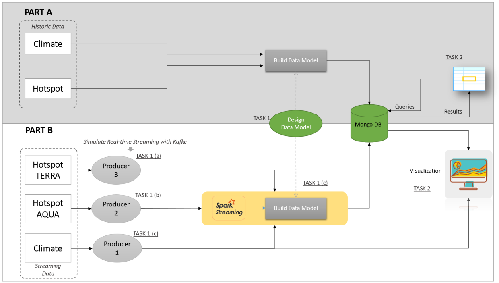

# Wildfire Hotspot Data Streaming Project

## Project Details
This project is to build an application, a complete setup from streaming to storing and analyzing the data  using Apache Kafka, Apache Spark Streaming and MongoDB to predict areas in Australia which are most susceptible to wildifres in real-time.

## Information on Dataset
Climate data is recorded on a daily basis whereas Fire data is recorded based on the occurrence of a fire on a particular day. Therefore, for one climate data, there can be zero or many fire data. All climate data is an average value for the particular day except for max wind speed..
The data is NOT row per weather station basis. You can simply think of it as, Station 1 was reporting data for X number of days and then Station 2 started reporting data because Station 1 was shut down for instance.
Global Horizontal Irradiance (GHI) is the total solar radiation incident on a horizontal surface.
Total precipitation (rain and/or melted snow) reported during the day in inches and hundredths; will usually not end with the midnight observation --i.e., may include the latter part of the previous day.
.00 indicates no measurable precipitation (includes a trace). Missing = 99.99 (For metric version, units = millimeters to tenths & missing = 999.9.)
Note: Many stations do not report '0' on days with no precipitation --therefore, '99.99' will often appear on these days. Also, for example, a station may only report a 6-hour amount for the period during which rain fell. See Flag field information below the source of data.
● A = 1 report of 6-hour precipitation amount.
● B = Summation of 2 reports of 6-hour precipitation amount.
● C = Summation of 3 reports of 6-hour precipitation amount.
● D = Summation of 4 reports of 6-hour precipitation amount.
● E = 1 report of 12-hour precipitation amount.
● F = Summation of 2 reports of 12-hour precipitation amount.
● G = 1 report of 24-hour precipitation amount.
● H = Station reported '0' as the amount for the day (eg, from 6-hour reports), but also reported at least one occurrence of precipitation in hourly observations --this could indicate a trace occurred but should be considered as incomplete data for the day.
● I = Station did not report any precipitation data for the day and did not report any occurrences of precipitation in its hourly observations --it's still possible that precipitation occurred but was not reported.

## Architecture
The overall architecture of the assignment setup is represented by the following figure.

Part A consists of reading data from csv files, building a model, saving to MongoDB and running various queries against the database. 
Part B consists of simulating real-time streaming of climate and hotspot data and processing it with Apache Kafka and Spark Streaming.
